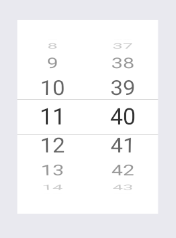

# AndroidTimePicker



### Usage

```js
...
import { View } from 'react-native';
import { AndroidTimePicker } from 'react-native-usit-ui';


...
  render() {
    return (
      <View style={{ flex: 1, alignItems: 'center', justifyContent: 'center' }}>
        <AndroidTimePicker
          time={this.state.time}
          onTimeChange={time => this.onTimeChange(time)}
        />
      </View>
    )
  }
```

### API

| Prop         | Default     | Type                   | Description                                           |
| :----------- | :---------- | :--------------------: | :-----------------------------------------------------|
| time         | `undefined` | `Date`                 | Initial date (hours and minutes) shown by time picker |
| onTimeChange | `null`      | `(time: Date) => void` | Action to trigger when time is changed                |