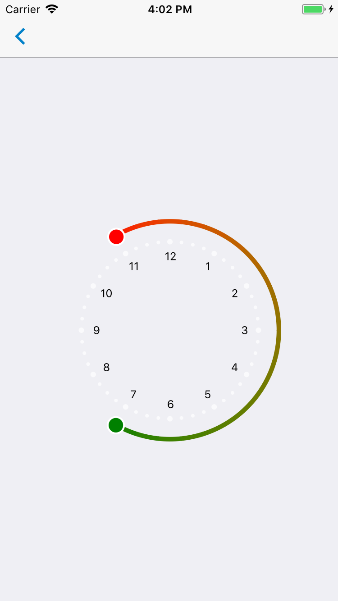

# CircularSlider



### Installation
Versions of react-native and react-native-svg need to be compatible. See https://www.npmjs.com/package/react-native-svg for version matching table. A downgrade of react-native-svg might be necessary.

## iOS
If you get this error: 'No component found for view with name "RNSVGCircle", the libRNSVG.a library must be added manually to Build Phases in Xcode.

Path: Libraries/RNSVG.xcodeproj/Products/libRNSV.a

Instructions: https://facebook.github.io/react-native/docs/linking-libraries-ios

### Usage

```js
...
import * as React from 'react';
import { View } from 'react-native';
import { G, Circle } from 'react-native-svg';

import { CircularSlider } from 'react-native-usit-ui';

type HoursAndMinutes = {
  hour: number,
  minute: number,
};

const SLIDER_ICON_TOP = (
  <Circle cx="9" cy="9" r="9" stroke="white" strokeWidth="2" fill="red" />
);

const SLIDER_ICON_BOTTOM = (
  <Circle cx="9" cy="9" r="9" stroke="white" strokeWidth="2" fill="green" />
);

class ClockPage extends React.Component<ClockPageProps, ClockPageState> {
  constructor(props: ClockPageProps) {
    super(props);
    this.state = {
      startAngle: (Math.PI / 6) * 23,
      angleLength: (Math.PI / 6) * 8,
      startTime: { hour: 23, minute: 0 },
      endTime: { hour: 7, minute: 0 },
      timeDiff: { hour: 8, minute: 0 },
    };
  }

  onUpdate = ({ startAngle, angleLength }) => {
    this.setState({
      startAngle: this.roundAngleToFives(startAngle),
      angleLength: this.roundAngleToFives(angleLength),
    });
  };

  onUpdateTime = ({ startTime, endTime, timeDiff }) => {
    this.setState({
      startTime: startTime,
      endTime: endTime,
      timeDiff: timeDiff,
    });
  };

  roundAngleToFives(angle) {
    const fiveMinuteAngle = (2 * Math.PI) / 144;
    return Math.round(angle / fiveMinuteAngle) * fiveMinuteAngle;
  }

  render() {
    return (
      <View style={{ flex: 1, justifyContent: 'center', alignItems: 'center' }}>
        <CircularSlider
          onUpdate={this.onUpdate}
          onUpdateTime={this.onUpdateTime}
          startAngle={this.state.startAngle}
          angleLength={this.state.angleLength}
          segments={20}
          strokeWidth={5}
          radius={120}
          gradientColorFrom={'red'}
          gradientColorTo={'green'}
          showClockFace={true}
          clockFaceColor={'black'}
          stopIcon={
            <G scale="1.1" transform={{ translate: '-8, -8' }}>
              {SLIDER_ICON_BOTTOM}
            </G>
          }
          startIcon={
            <G scale="1.1" transform={{ translate: '-8, -8' }}>
              {SLIDER_ICON_TOP}
            </G>
          }
        />
      </View>
    );
  }
}
```

### API

| Prop              | Default   | Type       | Description                                                                                     |
| :---------------- | :-------- | :--------: | :---------------------------------------------------------------------------------------------- |
| onUpdate          | `undefined`       | `({startAngle: number, angleLength: number}) => void` | Callback to adjust start angle and angle length. See example above.                                                                                             |
| onUpdateTime          | `() => {}`       | `({startTime: {hour: number, minute: number}, endTime: {hour: number, minute: number}, timeDiff: {hour: number, minute: number}}) => void` | Callback to get time corresponding to startAngle and angleLength. See example above.                                                                                             |
| startAngle        | `undefined`       | `number`   | Start angle for outer circle in radians. Values between 0 and 2 pi.                             |
| angleLength       | `undefined`       | `number`   | Circumference of circle segment shown. Values between 0 and 2 pi.                               |
| segments          | `undefined`       | `number`   | Number of segements for gradient color. More segements give a more fine grained gradient scale. |
| strokWidth        | `40`      | `number`   | Width of outer circle.                                                                          |
| radius            | `120`     | `number`   | Radius of circular slider.                                                                      |
| gradientColorFrom | `#ff9800` | `string`   | Start color for gradient scale.                                                                 |
| gradientColorTo   | `#ffcf00` | `string`   | Gradient scales from start color to this color.                                                 |
| showsClockFace    | `undefined`       | `boolean`  | If true, numbers 1 to 12 will show inside outer circle.                                         |
| clockFaceColor    | `#9d9d9d` | `string`   | Color of numbers 1 to 12.                                                                       |
| bgCircleColor     | `#171717` | `string`   | Color of start/end-points on outer circle.                                                      |
| stopIcon          | `undefined`       | `element`  | SVG element at end of circle segment.                                                                                             |
| startIcon         | `undefined`       | `element`  | SVG element at start of circle segment.                                                                                             |
|                   |           |            |                                                                                                 |