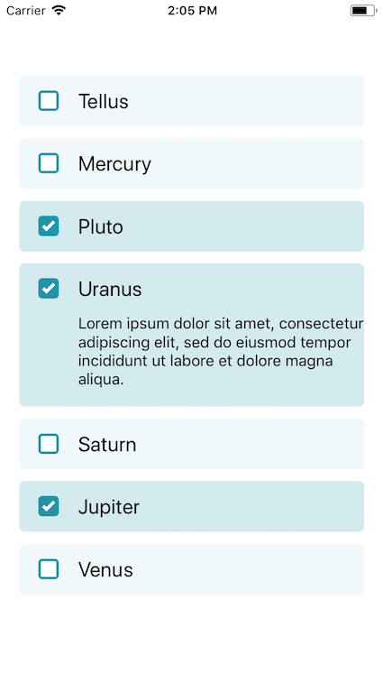

# MultipleOptionList



### Usage

\*Note that the screenshot uses defaultIcons and colors.primary

```js
...
import { ScrollView, Image } from 'react-native';
import { MultipleOptionList } from 'react-native-usit-ui';

...

const data = [
  { id: 'a', text: 'Tellus' },
  { id: 'b', text: 'Mercury' },
  { id: 'c', text: 'Pluto' },
  { id: 'd', text: 'Uranus' },
  {
    id: 'e',
    text: 'Saturn',
    subText: 'Lorem ipsum dolor sit amet, consectetur adipiscing elit, sed do        eiusmod tempor incididunt ut labore et dolore magna aliqua.',
  },
  { id: 'f', text: 'Jupiter' },
  { id: 'g', text: 'Venus' },
];

const defaultIcons = {
  // Icons from react-native-vector-icons could also be used in the same pattern
  checked: (color: string) => (
    <View style={{ backgroundColor: 'white', borderRadius: 11 }}>
      <CheckedBox color={color} />
    </View>
  ),
  unchecked: (color: string) => (
    <View style={{ backgroundColor: 'white', borderRadius: 11 }}>
      <UncheckedBox color={color} />
    </View>
  ),
};
...

  render() {
    return (
      <ScrollView
        style={{ flex: 1 }}
        contentContainerStyle={{
          alignItems: 'center',
          justifyContent: 'center',
        }}
      >
        <MultipleOptionList
          items={data}
          color="#f4414d" // Note that HEX value is required, due to opacity design
          icons={defaultIcons} // If not specified, default icons are used
          onChange={result => console.log(result)}
        />
      </ScrollView>
    );
  }
```

### API

| Prop              | Default        |                                                 Type                                                  | Description                                                                   |
| :---------------- | :------------- | :---------------------------------------------------------------------------------------------------: | :---------------------------------------------------------------------------- |
| items             | `null`         |                                           `Array<ListItem>`                                           | Data element to be inserted                                                   |
| maxOptions        | `undefined`    |                                               `number`                                                | Max number of options that can be selected, `undefined` means no limit        |
| onChange          | `() => {}`     |                               `(result: Array<string⎮number>) => void`                                | Callback with result whenever you click on a list element                     |
| onTextInputChange | `() => {}`     |                                       `(input: string) => void`                                       | Callback with input when this element is listed with `textInput={true}`       |
| color             | `#2294A8`      |                                               `string`                                                | Color of the button                                                           |
| icons             | `defaultIcons` | `{ checked: (color: string) => React.Component<*>, unchecked:(color: string) => React.Component<*> }` | Icons should be added as an object. Can be react-native-vector-icons or Image |
| scrollDisabled       | `false`        | `boolean`                     | Whether scrollView should be scrollable or not. |

```js
type ListItem = {
  id: string,
  text: string,
  subText?: string,
  textInput?: boolean, // Only one element may have this set to true
  inputPlaceholder?: string,
  inputKeyboardType?: string,
};
```
