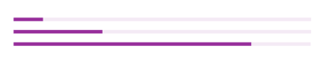

# ProgressBar



### Usage

```js
...
import { View } from 'react-native';
import { ProgressCircle } from 'react-native-usit-ui';
import { Text } from 'react-native-svg';


...
  render() {
    return (
      <View
        style={{
          flex: 1,
          justifyContent: 'center',
          alignItems: 'center',
        }}
      >
        <ProgressBar
          stepX={stepX}
          ofY={ofY}
          primaryColor={colors.primary}
          secondaryColor={colors.secondary}
        />
      </View>
    )
  }
```

### API

| Prop           | Default     | Type              | Description                           |
| :------------- | :---------- | :---------------: | :------------------------------------ |
| stepX          | `undefined` | `number`          | Current step                          |
| ofY            | `undefined` | `number`          | Total number of steps                 |
| primaryColor   | `#972E9B`   | `string`          | Color of completed area               |
| secondaryColor | `#F4EAF5`   | `string`          | Background color (non-completed area) |
| width          | `90%`       | `number | string` | Width of progressbar                  |
| height         | `4`         | `number`          | Height of progressbar                 |
| style          | `null`      | `Object`          | Style object for progressbar          |