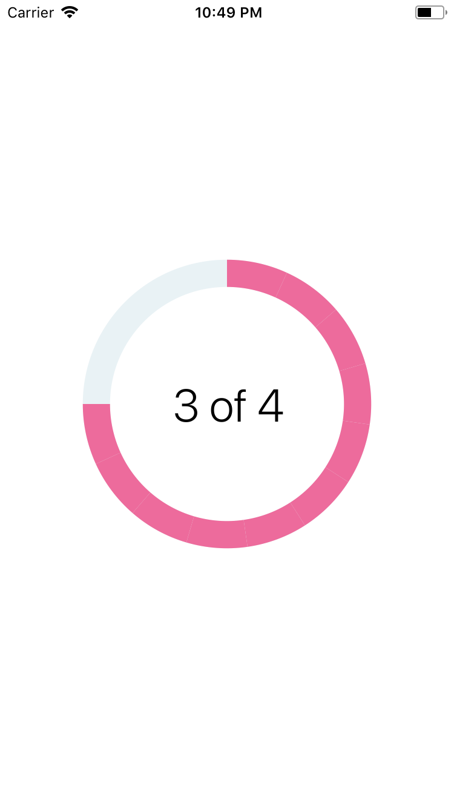

# ProgressCircle



### Usage

```js
...
import { View } from 'react-native';
import { ProgressCircle } from 'react-native-usit-ui';
import { Text } from 'react-native-svg';


...
  render() {
    return (
      <View
        style={{
          flex: 1,
          justifyContent: 'center',
          alignItems: 'center',
        }}
      >
        <ProgressCircle progress={0.75}>
          <Text fontSize="42" textAnchor="middle" fontWeight="300" y="-30">
            3 of 4
          </Text>
        </ProgressCircle>
      </View>
    )
  }
```

### API

| Prop          | Default     |     Type     | Description                                                         |
| :------------ | :---------- | :----------: | :------------------------------------------------------------------ |
| progress      | `0`         |   `number`   | Amount of circle to be drawn from 0 to 1                            |
| radius        | `120`       |   `number`   | Size of whole circle                                                |
| strokeWidth   | `25`        |   `number`   | Width of circle                                                     |
| color         | `#ED6B9C`   |   `string`   | Color of the progress circle                                        |
| bgCircleColor | `#E9F2F5`   |   `string`   | Color of the background circle                                      |
| children      | `undefined` | `React.Node` | Children to be drawn at the center of circle. MUST be Svg component |
