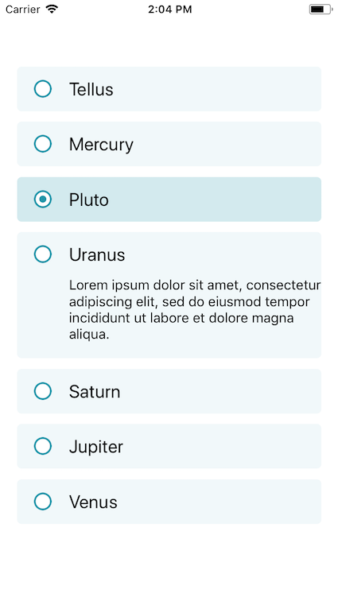

# SingleOptionList



### Usage

\*Note that the screenshot uses defaultIcons and colors.primary

```js
...
import { ScrollView, Image } from 'react-native';
import { SingleOptionList } from 'react-native-usit-ui';

...

const data = [
  { id: 'a', text: 'Tellus' },
  { id: 'b', text: 'Mercury' },
  { id: 'c', text: 'Pluto' },
  { id: 'd', text: 'Uranus' },
  {
    id: 'e',
    text: 'Saturn',
    subText: 'Lorem ipsum dolor sit amet, consectetur adipiscing elit, sed do        eiusmod tempor incididunt ut labore et dolore magna aliqua.',
  },
  { id: 'f', text: 'Jupiter' },
  { id: 'g', text: 'Venus' },
];

const icons = {
  // Icons from react-native-vector-icons could also be used in the same pattern
  checked: (
    <Image
      source={require('./checkedbox.png')}
      style={{ height: 20, width: 20 }}
    />
  ),
  unchecked: (
    <Image
      source={require('./uncheckedbox.png')}
      style={{ height: 20, width: 20 }}
    />
  ),
};
...

  render() {
    return (
      <ScrollView
        style={{ flex: 1 }}
        contentContainerStyle={{
          alignItems: 'center',
          justifyContent: 'center',
        }}
      >
        <SingleOptionList
          items={data}
          color="#f4414d" // Note that HEX value is required, due to opacity design
          icons={icons} // If not specified, default icons are used
          onChange={result => console.log(result)}
        />
      </ScrollView>
    );
  }
```

### API

```js
type ListItem = {
  id: string,
  text: string,
  subText?: string,
};

type Props = {
  items: Array<ListItem>,
  onChange: (result: string | number) => void,
  color?: string, //default is #2294A8
  icons?: { checked: React.Component<*>, unchecked: React.Component<*> },
};
```
